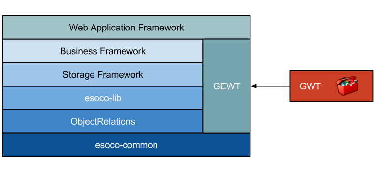

# Introduction
The **Simple Development Application Component Kit** (aka SDACK) project is a collection (or stack) of frameworks. These provide a foundation to build process-oriented applications. To create a SDACK application you define processes and entities. Processes encapsulate the business logic and entities the persistent state of the application. The foundation of SDACK is the **ObjectRelations** framework. It allows the generic modeling of relations between objects, like object orientation defines the modeling of objects.

The following illustration displays the current framework stack:

SDACK provides all components that are necessary to write applications. This includes areas like persistence, networking, logging, user interface, and more. For web applications it has a single dependency to the open source [GWT project](http://gwtproject.org), but that is not accessed directly. Instead you use it through a simplified abstraction. Such abstraction is one of the main properties (and goals) of SDACK. It makes projects widely independent from external APIs. Other external dependencies depend on the application environment, e.g. JDBC database drivers. The full framework stack is compact, either in code size as well as considering the number of API methods to learn.

The main goal of SDACK is to make application development as easy as possible. But it still provides the full functionality of all underlying APIs. The major building block for this is the ObjectRelations framework. It introduces a new programming paradigm that is the foundation of all upper levels of the stack. A major design principle of all frameworks is to hide as much non-essential code from the developer as possible. It provides simple to use APIs that need no configuration for default behavior. They also use modern software design patterns like Generics, Functional Programming, and Fluent Interfaces.

The following sections provide an overview of the single framework layers. They also link to detailed documentation for the respective layer.

## esoco-common

This library contains a small set of essential functionality like core interfaces and fundamental data structures. This library is independent from the ObjectRelations framework (which depends on it) and uses only a small set of standard Java APIs. That allows to use it in constrained Java environments like GWT where only a subset of Java APIs is available.

## ObjectRelations

The Object Relations library implements a new development concept. It's goal is to extend and enhance object-oriented software development. The main idea behind it is to model the relations between objects similar to the way object-orientation models the elements of a software development project. All frameworks on the stack above this project make extensive use of relations to achieve their purpose and are typically much more efficient than code that doesn't use this pattern. The ObjectRelations project also contains the code for functional programming that is used throughout all dependent frameworks. It is recommended to study the ObjectRelations documentation before other frameworks to get an understanding of the underlying principles.
esoco-lib

This library contains generic, application-independent code that are of use for almost all development projects. It defines fundamental data structures and interfaces and provides utility functions for several areas like I/O, reflection, string handling and more.

## Storage Framework

The storage framework (esoco-storage) provides a simple but powerful Abstraction to implement object persistence. It's generic API not only supports JDBC-based relational persistence engines but can also be easily adapted to different persistence concepts like object oriented databases or key-value stores (aka NoSQL databases). It provides direct persistence for arbitrary Java objects (POJOs) without the need for configuration other than defining the actual database connection. It is built on the ObjectRelations framework and the functional programming framework therein. Predicates from the latter are used for the definition of query criteria in a fluent way.

## Business Framework

The business framework (esoco-business) is the foundation for business-related applications. Based on ObjectRelations and the storage framework it features classes to model and persist business data and to define processes that create and modify business data. Processes can also perform interactions through application-specific user interfaces to query and present data to an application user. Besides processes another central element of the business framework are entities which represent a generic base to define persistent business data objects. Entities make the modeling of persistent data easy and even provide a simple way to integrate existing databases into a new software project that uses the esoco frameworks.

## GEWT / EWT

Most business applications needs some kind of user interface to interact with application users to display and input data. The GEWT framework is a generic user interface abstraction that uses the open source Google Web Toolkit (GWT) as the actual user interface implementation. GEWT has the same API as EWT, a desktop user interface framework that allows a Java desktop GUI to use any of the competing technologies AWT, Swing, and SWT. And with GEWT the same user interface can be displayed as a web application and vice versa with only minor adaptations. Another important aspect of EWT is that it provides a very simple and unified API for user interface implementations, freeing the developer from the need to handle the similar but differently implemented concepts of the UI toolkits.

## GWT Web Application Framework

The Web Application Framework (esoco-gwt) is the bridge between the business framework and GEWT, combining the business back-end (processes and persistent entities) with a GWT user interface into a consistent and easy to use framework for building client-server web applications. It handles the communication between the server side and the client running in a web browser, automatically transforming business data into visual representations in the browser and transferring user input to the server for process execution and persistence. It also features high-level components that are the building blocks for the implementation of complete web applications.

The Webapp framework also contains the base classes and core elements necessary to create a configurable application that can be deployed into an application server which uses a connection to a standard relational database like PostgreSQL or MySQL. The GwtApplication already supports the automatic historization of changes in persistent data, database and file logging, and background processing. It is only necessary to implement the business-specific entities and processes to create a full business application.